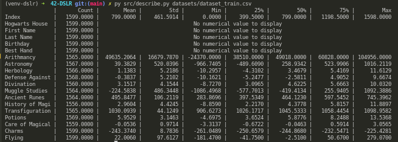
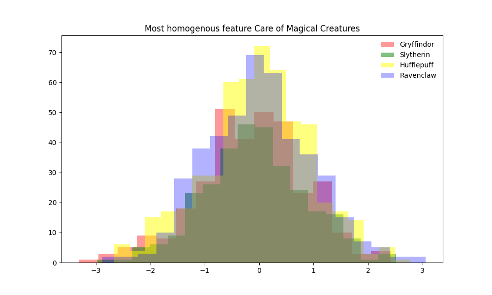
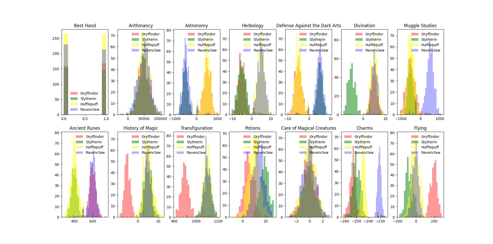
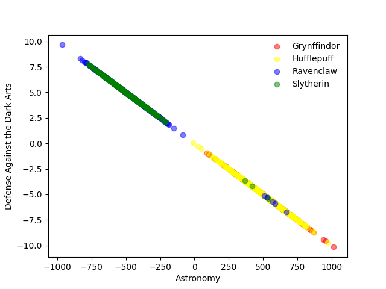
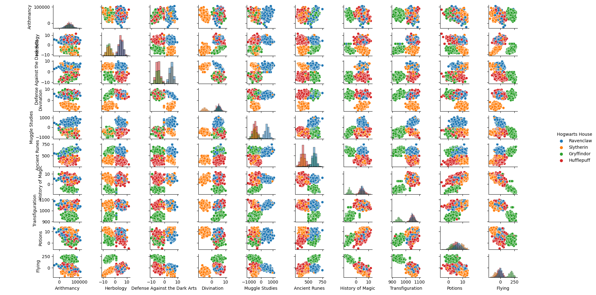

# DSLR (Data Science X Logistic Regression)

## About

➜ Let's discover Data Science through this project in the reconstruction of the Hogwarts Magic Hat!

This is the second project of the Artificial Intelligence branch at School 1337 Khouribga

## Math Behind Logistic Regression

#### Feature Scaling:


#### Logistic Regression:


## Installation

Run `python3 -m pip install -r requirements.txt`

## Usage

`python3 describe.py datasets/dataset_train.csv`

- Display informations on all numerical features / and non-numerical as bonus

`python3 histogram.py datasets/dataset_train.csv`

- Answer the following question: Which Hogwarts course has a homogeneous score distribution between the four houses ?

`python3 scatter_plot.py datasets/dataset_train.csv`

- Answer the following question: What are the two features that are similar ?

`python3 pair_plot.py datasets/dataset_train.csv`

- Show a pair_plot of all numerical features present in `datasets/dataset_train.csv`

`python3 logreg_train.py [-h] [-v] datasets/dataset_train.csv`

- -h: Show help message and exit
- -v: Show the Cost of each classifier in graph
- Train a model from an the input dataset

`python3 logreg_predict.py datasets/dataset_test.csv weights`

- Generate a file (houses.csv) of predictions for the given dataset

### Example

`python3 src/describe.py datasets/dataset_train.csv`

<div align="center">
  
</div>

`python3 src/histogram.py datasets/dataset_train.csv`

<div align="center">
  
</div>

`python3 src/histogram.py datasets/dataset_train.csv -all`

<div align="center">
  
</div>

`python3 src/scatter_plot.py datasets/dataset_train.csv`

<div align="center">
  
</div>

`python3 src/pair_plot.py datasets/dataset_train.csv`

<div align="center">
  
</div>

First we need to train our model with the provided dataset

```
➜ py src/logreg_train.py datasets/dataset_train.csv
Training against : Gryffindor
Training against : Hufflepuff
Training against : Ravenclaw
Training against : Slytherin
Weights saved in 'weights.npy',
Accuracy : 98.49 %
```

This will save the weights trained in `./weights.npy`

Then, to make predictions for a given dataset

`python3 src/logreg_predict.py datasets/dataset_test.csv weights.csv`

This will generate a file with all predictions in `./houses.csv`

```
➜ cat houses.csv
Index,Hogwarts House
...
```

run the evalution.py script (given by the 42):

script given by 42 that compare the results in houses.csv generated by ur prediction script with the datasets_truth.csv that contains real correct values (given by the 42 correction page) :

```
➜ py evaluate.py
Your score on test set: 0.988
Good job! Mc Gonagall congratulates you.
```

##### Project done in 2021/06/26
